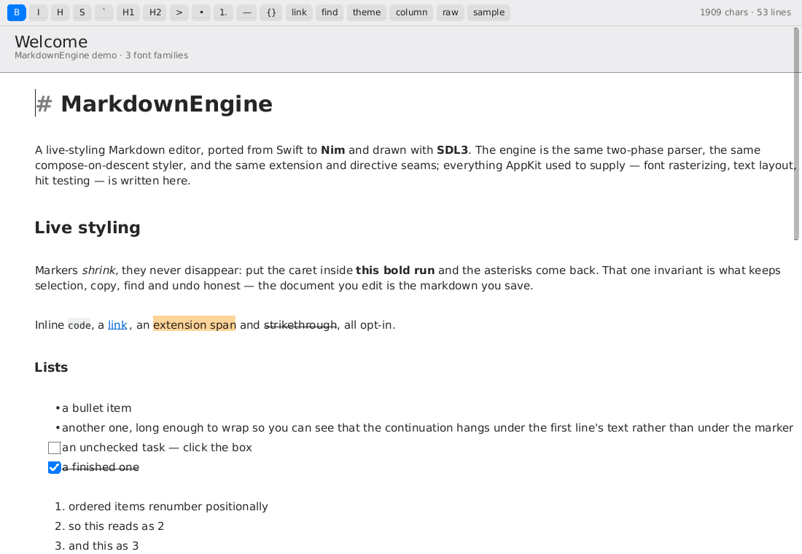
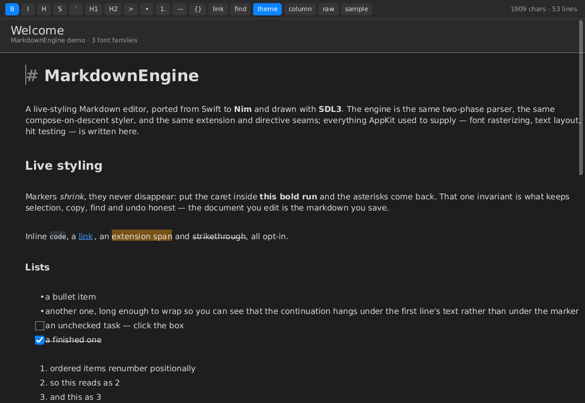
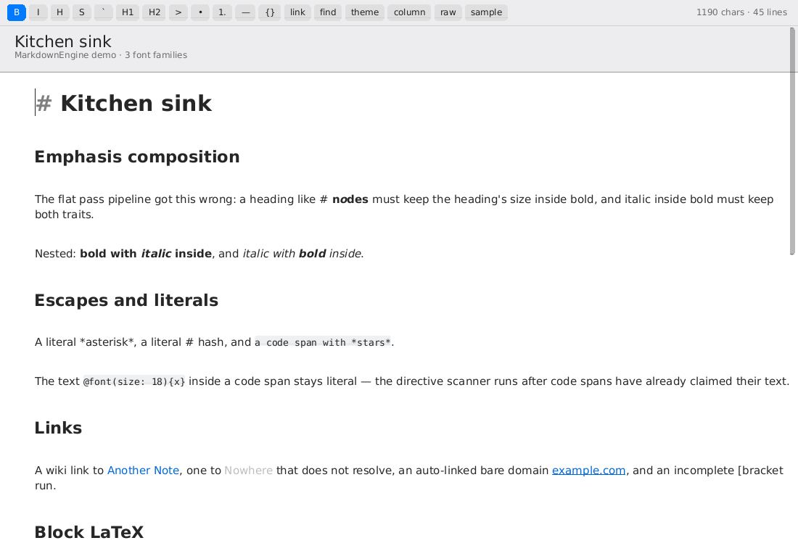

<h1 align="center">MarkdownEngine — Nim / SDL3</h1>

<p align="center">
  <a href="https://nim-lang.org"></a>
  
  <a href="https://libsdl.org"></a>
  <a href="LICENSE"></a>
</p>

<p align="center">
  
</p>

A live-styling Markdown editor, ported to **Nim** from
[`nodes-app/swift-markdown-engine`](https://github.com/nodes-app/swift-markdown-engine)
and drawn with **SDL3**. Linux only.

It is the same engine: the same two-phase parser, the same compose-on-descent
styler, the same extension and directive seams, the same UTF-16 range
currency. What changed is everything AppKit used to supply — font
rasterisation, text layout, hit testing, the scroll view, the undo manager,
the pasteboard — which is written here instead, against the Nim standard
library and the SDL3 bindings and nothing else.

```bash
nim c -r -d:release src/mdedit.nim          # build and run the editor
nim c -r --hints:off tests/test_all.nim     # 451 tests, 94 suites
```

## What "no other library" bought and cost

The only dependency is [nim-lang/sdl3](https://github.com/nim-lang/sdl3),
vendored in [`vendor/sdl3.nim`](vendor/sdl3.nim) (MIT) so a checkout builds
with no package fetch. SDL3 gives a window, a GPU-backed renderer, filled
rectangles, textures, and events. It gives no text.

Everything between "here is a `seq[uint16]` of markdown" and "here are pixels"
had to be written:

| AppKit supplied | This port has | Where |
|---|---|---|
| CoreText rasterisation | A TrueType parser and scanline rasteriser: sfnt tables, simple and composite glyphs, quadratic flattening, analytic signed-area antialiasing, synthetic bold and oblique | [`src/mdui/truetype.nim`](src/mdui/truetype.nim) |
| `NSFont` / font matching | Family groups resolved against the installed fonts, with a fallback cascade per code point | [`src/mdui/fontmanager.nim`](src/mdui/fontmanager.nim) |
| TextKit 2 layout | Paragraph-based line breaking, caret geometry, hit testing, selection rectangles, vertical motion with a sticky x | [`src/mdui/layout.nim`](src/mdui/layout.nim) |
| `NSTextStorage` | A run-based attributed string with per-paragraph splicing | [`src/mdui/textstorage.nim`](src/mdui/textstorage.nim) |
| `NSRegularExpression`, `NSDataDetector` | Hand-written scanners, one per pattern the Swift used | throughout the engine |
| `NSAttributedString.Key: Any` | A closed `AttrKey` enum and an `AttrValue` variant | [`src/markdownengine/attributes.nim`](src/markdownengine/attributes.nim) |
| `NSColor` dynamic colors | A `Color` carrying both appearances, resolved at draw time | [`src/markdownengine/color.nim`](src/markdownengine/color.nim) |

The consequences are worth stating plainly, because they are what a reader
will hit first:

- **No image decoding.** The standard library has no PNG or JPEG decoder and
  there is no `zlib` here, so `` and `![[embed]]` read BMP (through
  SDL3's own loader) and PPM/PGM. Screenshots are *written* as PNG using
  DEFLATE **stored** blocks — larger than a compressed file, read by every
  decoder, and enough to make the headless smoke test look at real pixels.
- **No SF Symbols.** A directive's `symbolPresentation` travels to the
  renderer as a name, and the renderer draws a shape or a Unicode glyph for
  the handful it knows. Unknown names leave the source visible rather than
  collapsing it to a gap.
- **No regex.** `std/re` and `std/nre` wrap PCRE, so every pattern the Swift
  expressed as a regex is a scanner here — including the six incomplete-link
  patterns, whose end-of-document `$` semantics are reproduced exactly.
- **Only scalable TrueType.** The rasteriser reads `glyf` outlines. A CFF/OTF
  face (Inter, for instance) is rejected at load and the next family in the
  group is tried.
- **No spell checker.** The `akSpellingState` attribute is still produced and
  still suppressed over code, links and LaTeX, so the data is there for an
  embedder that has one.

## Requirements

- **Nim 2.2** or later
- **SDL3** installed as a shared library (`libSDL3.so`), loaded dynamically
- At least one scalable TrueType family installed. DejaVu or Liberation
  covers sans, serif and monospace; the font manager picks the first group
  whose regular face loads.

No Nim packages are required, so `nimble` is optional — every command below is
plain `nim`.

```bash
# Debian / Ubuntu
sudo apt install libsdl3-0 fonts-dejavu-core
```

## Running it

```bash
nim c -r -d:release src/mdedit.nim           # the editor, with a sample document
nim c -r -d:release src/mdedit.nim notes.md  # …on a file
```

The demo carries two sample documents (a tour and a kitchen sink), a toolbar
wired to the formatting actions, a find bar, a context menu, a theme toggle,
and a directive autocomplete picker. `--render-once` draws a single frame and
prints a summary instead of opening a window, which is what the headless smoke
test uses:

```bash
SDL_VIDEODRIVER=dummy ./mdedit --render-once
# 1909 chars, 126 attribute runs, 53 lines, 1909 laid-out glyphs,
# 28 tokens, 142 glyph uploads, content height 1415.8
```

<p align="center">
  
  
</p>

## Using the engine

The engine half (`src/markdownengine/`) has no UI dependency at all — it
imports nothing outside `std/`. Give it text and a configuration, get back
styled ranges:

```nim
import markdownengine

let text = initText("# Hello, *world*")
var config = initConfiguration()

for (range, attributes) in styleAttributes(text, config,
                                           caretLocation = -1,
                                           containerWidth = 600.0):
  echo range, " ", attributes.len, " attributes"
```

`styleAttributes` is the whole public surface for styling. It runs the parse
(or reuses one you hand it), walks the AST, and returns overlapping
`StyledRange`s in emission order — later ranges win per key, which is what
`flattenedRuns` collapses when a caller wants one write per character.

### Measuring text

The engine never measures text itself. It takes a `TextMetrics` — two procs,
one for a font's metrics and one for a string's width — so the same styler
runs under the real rasteriser and under a cheap approximation in tests:

```nim
let metrics = fonts.textMetrics()          # from mdui/fontmanager
discard styleAttributes(text, config, tm = metrics, containerWidth = 600.0)
```

`defaultTextMetrics` is the approximation, and it is what every engine-level
test uses.

### Services

Four seams, each with a no-op default, exactly as in the Swift:

| Service | What you supply |
|---|---|
| `WikiLinkResolver` | Resolve `[[Name]]` to a stable opaque id |
| `EmbeddedImageProvider` | An `ImageHandle` for `![[Name]]` |
| `SyntaxHighlighter` | Coloured runs for a fenced block's language |
| `LatexRenderer` | An `ImageHandle` for a formula |

```nim
config.services = initServices(wikiLinks = newWikiLinkResolver(
  resolveProc = proc (displayName: string, r: Range): (WikiLinkResolution, bool) {.closure, gcsafe.} =
    {.cast(gcsafe).}:                        # the closure reads your own index
      if displayName in myIndex:
        (WikiLinkResolution(id: myIndex[displayName], exists: true), true)
      else:
        (WikiLinkResolution(), false)))
```

A service returning nothing degrades visibly rather than silently: an
unresolved wiki link renders disabled, a block with no highlighter renders as
plain monospace, a formula with no renderer shows its source.

### Theming and tuning

Every colour the editor puts on screen comes from `MarkdownEditorTheme`, and
every spacing and sizing knob from `MarkdownEditorConfiguration`:

```nim
var config = initConfiguration()
config.theme.bodyText = Color(light: rgba(0.1, 0.1, 0.1), dark: rgba(0.9, 0.9, 0.9))
config.codeBlock.fontSizeScale = 0.9
config.headings.fontMultipliers = @[2.4, 1.8, 1.4, 1.1, 0.9, 0.75]
config.lists.helpersEnabled = false
```

A `Color` carries both appearances and is resolved at draw time, so switching
appearance re-resolves rather than re-styles. The theme also carries the
surfaces AppKit used to own — selection fill, caret, scroller knob, table grid
— because nothing below this layer has an opinion about them.

### Extensions

An extension is **a pair of delimiters** plus how to style what sits between
them. `==highlight==`, `~~strikethrough~~` and `::: … :::` are opt-in, not
built in:

```nim
config.extensions = @[newHighlightExtension(),
                      newStrikethroughExtension(),
                      newContainerExtension()]
```

Unregistered syntax stays literal text. An extension contributes an inline
form, a fenced block form, or both, plus the attributes for its content and an
HTML wrapper for rich copy. The parser owns all the geometry, marker hiding,
caret reveal and incremental restyling, so an extension behaves exactly like a
built-in and cannot disturb its neighbours.

### Directives

The second seam, for constructs that need a **name and typed arguments**
rather than delimiters:

```nim
config.directives = @[newFontDirective(), newColorDirective()]
```

```markdown
@font(size: 18){eighteen point}, @font(size: 1.5em){half again}, @color(red){tinted}
```

Two forms: **container** (`@font(size: 18){text}`) and **self-contained**
(`@pagebreak`). A container's font transform composes over the font inherited
at that point in the tree, so `@font(size: 18){**bold**}` is bold *and* 18pt,
and the same call inside a heading keeps the heading's weight. There is no
"applies to everything after me" form — a directive's effect is scoped to its
own node, which is what keeps per-keystroke restyling block-local.

A self-contained call draws a glyph in place of its own source. The source is
never removed: it collapses to zero width, the same mechanism inline LaTeX
uses, so selection, find, copy and undo still see the real characters, and the
caret entering the call reveals them.

The marker defaults to `@`, is configurable per registry and per directive,
and several can be registered at once. An unregistered name stays literal, and
a directive only opens at a non-word character — so `name@example.com` is
never a directive.

One limit worth knowing before authoring one, inherited from the Swift and
pinned by its tests: a body holding a span claimed by an *earlier* parse pass
— an inline code span, or a backslash escape — leaves the whole construct
literal rather than producing a directive around it.

```markdown
@font(size: 18){this has `code` in it}   ← not a directive, stays as typed
@font(size: 18){this has *emphasis*}     ← fine, composes normally
```

Constructs claimed in the same pass or later (`$…$`, links, emphasis, nesting)
work inside a body.

**Autocomplete** covers both directive names and argument values. The engine
detects the trigger, ranks the candidates and reports a replacement range; the
demo draws the list in about sixty lines. Value candidates come from a
directive's own `valueCompletionsProc`, whose default already answers anything
the schema declares (closed keyword sets, booleans) — implement it only when
the domain is dynamic or too large to declare. The demo's `@flag` offers every
ISO region that way, matching on code or country name.

`newFontDirective` and `newColorDirective` are reference implementations meant
to be read; they are not registered unless you register them. Directives
carrying curated data or document policy belong to the embedder —
[`src/mdui/demodirectives.nim`](src/mdui/demodirectives.nim) has `@icon`,
`@flag`, `@emoji` and `@pagebreak` as worked examples.

## Tests

```bash
nim c -r --hints:off tests/test_all.nim
```

451 tests across 94 suites, ported case by case from
`Tests/MarkdownEngineTests/`. Each file names the Swift suite it came from,
and where this port's behaviour deviates the test says so and why. The two
worth knowing about:

- **`test_incremental.nim`** is the differential fuzz: after every random edit,
  the incremental parse — descriptor-driven, widened-descriptor and
  scan-driven — must produce tokens identical to a from-scratch parse. The
  incremental path may fall back at any time; equivalence is the only
  contract. A failing seed reproduces exactly.
- **`test_styler.nim`**'s flattened-runs suite checks the fast attribute merge
  against the naive loop it replaced, over randomised overlap storms, because
  "faster" is only half the requirement.

The suites run in one binary. The engine keeps module-level caches keyed by
content, so sharing a process across suites is sound — and running them
together is the only thing that would catch it if that stopped being true.

CI runs them on `ubuntu-latest` (`.github/workflows/ci.yml`, the
*Build & Test (Linux)* job), then builds the editor and renders one frame
headlessly. The suite itself needs no SDL3: the bindings `dlopen` lazily and
nothing under test reaches an SDL call, so it runs before SDL3 is even built
and a logic failure reports in seconds. SDL3 is built from source there
because it is not packaged for Ubuntu 24.04, and cached between runs.

## Divergences from the Swift

Everything here is deliberate, commented at the site, and pinned by a test.

- **Autolinked URLs are styled explicitly.** AppKit painted a `.link` run in
  the system link colour on its own; nothing below this layer does, so the
  colour and underline are stated by the styler. Without this a resolving
  wiki-link rendered as body text and read as broken.
- **A scheme-less host gets `https`,** where `NSDataDetector` supplied `http`.
  The detector's choice predates ubiquitous TLS; today an `http` href on a
  TLS-only host is a dead link in a pasted document.
- **The incomplete-link pass skips complete links.** `[[Name]]` satisfies the
  Swift's `\[[^\]\r\n]+\](?!\()` pattern, which was harmless there only
  because AppKit repainted the link colour afterwards.
- **A directive's symbol name reaches the renderer as data.** The Swift
  resolved it to an `NSImage` in the styler and fell back to literal when the
  symbol did not exist; here the decision moves one layer down, so the
  renderer can draw a visible fallback.
- **`TableAlignment`'s members are `tca…`,** not `ta…`: two exported enums
  sharing a member name make every unqualified use ambiguous in Nim.

Several bugs were found while porting the tests and fixed in the engine
itself — an arithmetic overflow in scope normalisation and another in the
wiki-link splice guard, a line-range walk that swallowed the following
paragraph, table headers measured at body weight but drawn bold, and
reference equality on a value-semantics paragraph style. Each has a test.

## Layout

```
src/
├── markdownengine.nim          # umbrella module
├── markdownengine/             # the engine — std/ only, no UI
├── mdui/                       # the UI layer — SDL3, the rasteriser, the editor
└── mdedit.nim                  # entry point
tests/                          # the ported suite
vendor/sdl3.nim                 # nim-lang/sdl3, MIT
```

[ARCHITECTURE.md](ARCHITECTURE.md) is the per-module tour, in the order text
flows through the engine.

`Sources/`, `Tests/`, `Demo/` and `Package.swift` are the Swift original,
kept in place as the reference this port is checked against: the Nim test
files name the Swift suite each case came from, and the comments cite it
where behaviour had to change. Nothing in the Nim build reads them.

## License

Apache 2.0, as the original. See [LICENSE](LICENSE).
The vendored SDL3 bindings are MIT; their notice is at the top of
[`vendor/sdl3.nim`](vendor/sdl3.nim).
